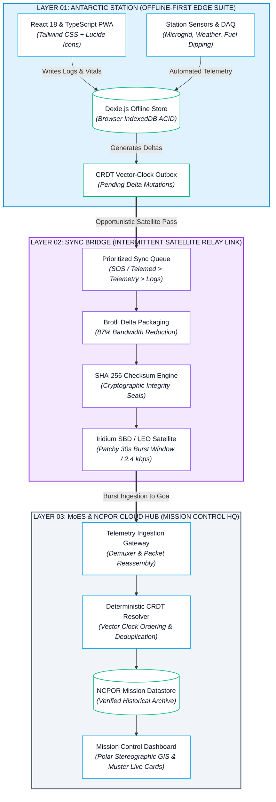

# AntarcticaSync

> **SIH 2025 · Problem Statement ID: SIH26060**  
> **Digital Platform for Efficient Remote Management of Indian Antarctic Research Stations**  
> **Theme:** Smart Automation | **Category:** Software | **Organization:** Ministry of Earth Sciences (MoES) & NCPOR Goa  
> **Team:** FrostByte

---

## Overview

AntarcticaSync is a resilient, offline-first digital mission-control web platform purpose-built for the operational constraints of Indian Polar and High-Altitude Research Stations:
- **Bharati Station** (Larsemann Hills, East Antarctica · 69°24′S, 76°11′E)
- **Maitri Station** (Schirmacher Oasis, Queen Maud Land · 70°45′S, 11°44′E)
- **Himansh Research Station** (Chandra Basin, Spiti Valley, Himalayas · 13,500 ft / 4,080 m)
- **Himadri Station** (Ny-Ålesund, Svalbard, Arctic)

Engineered specifically to overcome polar satellite blackouts, extreme sub-zero conditions (-65°C), isolated winter-overs, and high-latency narrowband communications (Iridium 2.4 kbps).

---

## Core System Modules

### 1. Resilient Offline-First Architecture & CRDT Synchronization
- **Zero Cloud Dependency**: All field observations, fuel dipping records, and microgrid telemetry persist directly in browser IndexedDB via Dexie.js.
- **Split-Screen CRDT Terminal**: Deterministic conflict resolution using Conflict-Free Replicated Data Types (CRDTs) and vector clocks.
- **87% Bandwidth Reduction**: Payload diffing and compression allow transaction sync through a 30-second patchy Iridium burst window.
- **Cryptographic Integrity**: SHA-256 tamper-proof seals on every sync packet and telemetry export.

### 2. High-Latitude South Polar Stereographic Projection (GIS)
- South Pole-centric azimuthal stereographic projection (70°S to 90°S) designed for true polar navigation where standard Web-Mercator maps fail.
- **Live Convoy Telemetry**: Real-time tracking of inland deep-ice traverses (PistenBully PB-01 on Amery Ice Shelf) with speed, fuel on-board, GPS coordinates, and VHF signal telemetry.
- **Iridium Orbital Pass Timer**: Live countdown to the next polar satellite communication pass.

### 3. Blizzard Lockdown Protocol & Smart Circuit Load Shedder
- One-click Blizzard Emergency Protocol.
- **Automated Personnel Muster (24/24)**: Live safety roll-call across station shelter modules.
- **Smart Microgrid Load Shedder**: Automatically cuts non-essential loads (heavy laundry, recreation heaters) to shed 32 kW, reserving 100% generator capacity for life-support radiators and clinic oxygen.
- **Offline Survival Runbooks**: Cached local protocols for sudden generator trips, whiteout search lines, and severe frostbite treatment.

### 4. Dynamic Thermodynamic Winter Survival Forecaster
- Simulates outside temperatures down to -65°C and katabatic winds up to 85 knots.
- Dynamic thermodynamic burn model calculates heat loss, scaling daily fuel consumption from 1,100 L/day up to 2,350 L/day.
- Projects endurance against the *MV Vasiliy Golovnin* resupply ship arrival date with automated ski-plane emergency airdrop alerts.

### 5. Madrid Protocol Environmental & Clean Microgrid Tracker
- Live monitoring of vertical-axis wind turbines (11.8 kW) and polar summer 24-hr solar PV arrays (36.5 kW).
- Carbon Offset Counter: Tracks liters of diesel saved (18,450 L) and metric tons of carbon soot avoided (48.8 tons).
- **Retrograde Waste Ledger**: Categorized tracking of chemical, electronic, and incinerator waste barrels staged for ship return.

### 6. Offline Telemedicine & AIIMS Consult Packager
- Guided clinical triage for hypothermia, carbon monoxide exposure, and suspected appendicitis during polar night isolation.
- Packages vitals and ECG traces into an encrypted <10 KB teleconsult dossier for burst transmission to AIIMS New Delhi / INHS Asvini Goa.

### 7. Hands-Free Polar Voice Briefing
- Integrated Web Speech synthesizer reads the morning station operations briefing aloud for field engineers wearing heavy sub-zero thermal mitts.

---

## Technology Stack & Architecture Flowchart



### Technology Matrix

| Layer | Component | Technology / Library | Purpose & Operational Function |
|---|---|---|---|
| **Frontend** | UI & State Engine | `React 18`, `TypeScript` | Responsive mission control interface with strict type safety |
| **Styling** | Dark UI & Layout | `Tailwind CSS`, `PostCSS` | Sub-zero high-contrast dark theme optimized for low-glare field use |
| **Edge Storage** | Offline Datastore | `Dexie.js` (`IndexedDB`) | Zero-cloud persistent local storage for station telemetry and logs |
| **State Sync** | Conflict Resolution | `CRDTs`, `Vector Clocks` | Deterministic, multi-master state reconciliation across intermittent links |
| **Cartography** | Polar Navigation | `Custom SVG Projection` | South Pole Azimuthal Stereographic Projection (`EPSG:3031`) |
| **Iconography** | Telemetry Indicators | `Lucide React` | Clean, lightweight SVG interface icons |
| **Voice Briefing**| Hands-Free Audio | `Web Speech Synthesis API` | Audio playback of morning station logs for mitt-wearing field engineers |
| **Build & Tooling**| Dev Runtime | `Vite 6`, `Node.js` | Lightning-fast HMR and optimized production asset bundling |
| **Hosting** | Edge Cloud | `Vercel` | High-availability global CDN edge deployment |

---

## Running Locally

```bash
# 1. Install dependencies
npm install

# 2. Start development server
npm run dev

# 3. Open in browser
http://localhost:3000
```

### Production Build

```bash
npm run build
```

---

## Smart India Hackathon (SIH 2025)
- **Problem Statement:** SIH26060 — Digital Platform for Efficient Remote Management of Indian Antarctic Research Stations
- **Ministry:** Ministry of Earth Sciences (MoES) & National Centre for Polar and Ocean Research (NCPOR)
- **Developed by:** Team FrostByte
